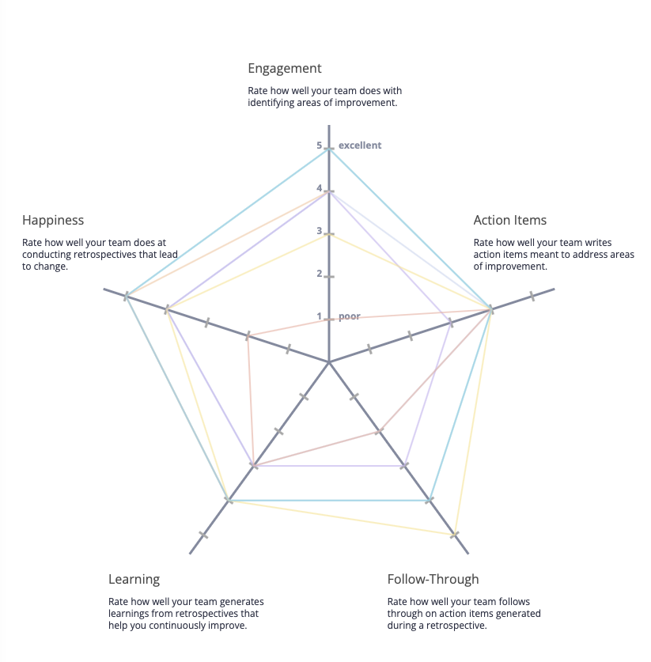
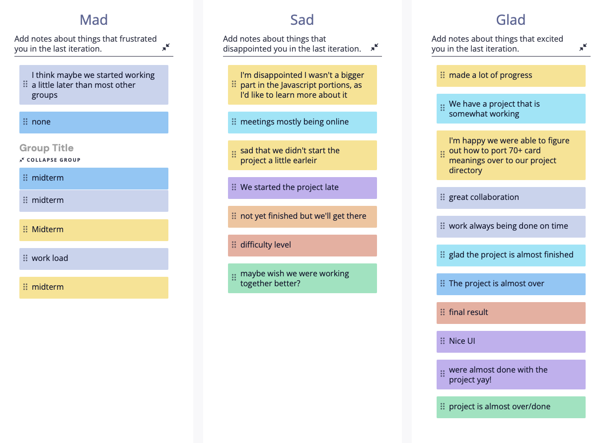

# We Take Shower's General Opinion, Retrospective #1

Meeting Date: 5/28/2023 @ 4:00 PM
Created by: Nicholas Ho
Members in Attendance: Bingyang, Sholehani, Nicholas, Kartik, Benjamin, Nathan, Maanasa

# Retrium 1

People were generally happy with the progress of the group. However, people voiced some concerns with work division and the fast pace. They felt like they weren't learning that much, and they were somewhat stressed about the way the project was being run.

# Retrium 2

People were generally mad with the midterm and the fact that we started later than the rest of the groups. They were also sad about how we were collaborating as well as the difficulty of the project. However, they were happy with the project thus far and how far we had come.

# Going Forward

-   Make sure we're listening to each other.
-   Redistribute teams so people with more Javascript experience can teach those with less.

Meeting Ended: 4:40 P.M.
